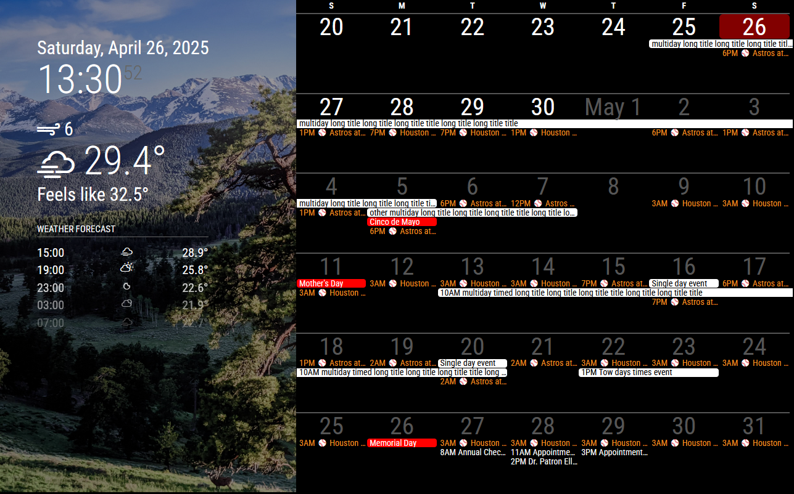

# MMM-SimpleCalendar
MMM-SimpleCalendar is a [MagicMirror²](https://magicmirror.builders/) module

## Screenshot


Screenshot shows **MMM-SimpleCalendar** with [default clock and weather modules](https://docs.magicmirror.builders/modules/introduction.html), and [MMM-BackgroundSlideshow](https://github.com/darickc/MMM-BackgroundSlideshow).

## Functionality
This MMM-SimpleCalendar module was created as a digital replacement for a paper calendar, optimized for displaying on an old tablet screen. 
The goal is to provide a simple, highly adjustible, and easy-to-tweek calendar module. 

**Key features include:**
- Customizable width and height to match the display screen resolution. 
- Optimized for `fullscreen_below` or `fullscreen_above` position with empty space on the left side of the calendar.
- Adjustable font sizes for days of the week, day numbers, and events.
- Configurable start of the week (Sunday or Monday) to match personal preference.
- Two display modes: "monthly" (paper calendar mode) and "6weeks" (rolling 6 weeks).
- Touch gesture navigation (swipe left/right for previous/next week).
- Keyboard navigation (up/down arrow keys for previous/next week).
- Option to show or hide event start times.

See [Configuration Options](#configuration-options) below.

## Installation
1. Navigate to your MagicMirror² `modules` folder:

   ```sh
   cd ~/MagicMirror/modules
   ```
2. Clone the repository:

   ```sh
   git clone https://github.com/jhjang101/MMM-SimpleCalendar.git
   ```
## Configuration
To use this module, add it to the `modules` array in your `config/config.js` file:

```js
modules: [
    {
        module: 'MMM-SimpleCalendar',
        position: "fullscreen_above",
        config: {
            width: "1280px",
            height: "800px",
            startOfWeek: 0, // 0 for Sunday, 1 for Monday (default: 0)
            dayOfWeekFontSize: "14px",
            dayNumberFontSize: "40px",
            eventFontSize: "14px",
            mode: "monthly", // "monthly" or "6weeks" (default: "monthly")
            refreshInterval: 10 * 60 * 1000, // Milliseconds interval for refreshing calendar (default: 10 minutes)
            showEventTime: true, // true or false to show the event start time (default: true)
            timeFormat: "HH:mm" // Moment.js time format (default: "HH:mm", 12hr format: "hh:mm A", hour only: "hA")
        }
    },
]
```
To display events properly, you need to configure the [MagicMirror² default calendar module](https://docs.magicmirror.builders/modules/calendar.html) to fetch calendar events.

Here's a basic example of how you might configure the default calendar module to provide events to MMM-SimpleCalendar:

```javascript
modules: [
    // ... other modules ...
    {
        module: 'calendar',
        header: "US Holidays",
        // position: "top_left",    
        config: {
            maximumEntries: 100,
            calendars: [
                {
                    fetchInterval: 10 * 60 * 1000,
                    url: "https://calendar.google.com/calendar/ical/your%40gmail.com/private-efhg/basic.ics",
                    color: "#ffffff"
                },
                {
                    fetchInterval: 10 * 60 * 1000,
                    url: "https://ics.calendarlabs.com/76/mm3137/US_Holidays.ics",
                    color: "#ff0000"
                },
            ]
        }
    },
    {
        module: 'MMM-SimpleCalendar',
        position: "fullscreen_above",
        config: {
            width: "1280px",
            // ... other configs ...
        }
    },
    // ... other modules ...
]
```

## Configuration Options:

| Option  | Description  |
|---------|--------------|
| `width` | Sets the width of the calendar container.<br>Example values: `"300px"`, `"50%"`.<br>Default value: `"1280px"` (consider adjusting for your screen resolution, especially for a tablet). |
| `height` | Sets the height of the calendar container.<br>Example values: `"300px"`, `"50%"`.<br>Default value: `"800px"` (consider adjusting for your screen resolution, especially for a tablet). |
| `startOfWeek` | Defines the first day of the week.<br>Possible values: `0` (Sunday), `1` (Monday).<br>Default value: `0`. |
| `dayOfWeekFontSize` | Sets the font size for the weekday names (e.g., "S", "M", "T").<br>Default value: `"14px"`. |
| `dayNumberFontSize` | Sets the font size for the day numbers in the calendar grid.<br>Accepts CSS units.<br>Default value: `"40px"`. |
| `eventFontSize` | Sets the font size for the event titles.<br>Accepts CSS units.<br>Default value: `"14px"`. |
| `mode` | Determines how the calendar weeks are displayed.<br>Possible values: `"monthly"`, `"6weeks"`.<br>Default value: `"monthly"`. |
| `refreshInterval` | The interval (in milliseconds) at which the module will refresh calendar.<br>Possible values: Number (milliseconds).<br>Default value: `10 * 60 * 1000` (10 minutes). |
| `showEventTime` | Controls whether the start time of events is displayed.<br>Possible values: `true`, `false`.<br>Default value: `true`. |
| `timeFormat` | Specifies the format for displaying event times (using [Moment.js format codes](https://momentjs.com/docs/#/parsing/string-format/)).<br>Possible values: Moment.js format string (e.g., `"HH:mm"`, `"h:mm a"`, `"hA"`, etc.).<br>Default value: `"HH:mm"`. |